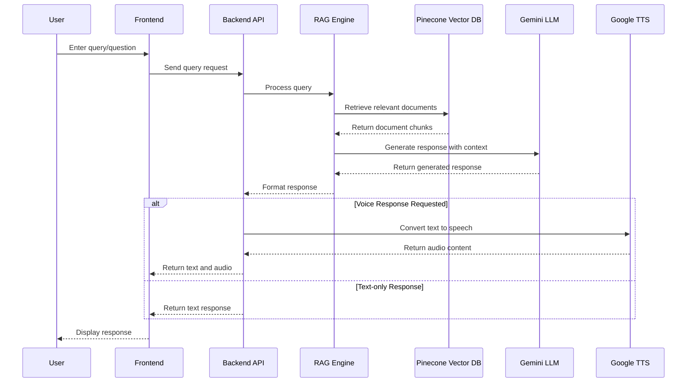

# RAG Virtual Agent v2 - Backend


## Project Overview

This is the backend component of a RAG (Retrieval-Augmented Generation) Virtual Agent application. The project is built using FastAPI and Python, with a focus on creating a powerful and flexible RAG system. The application leverages modern AI technologies to provide intelligent responses based on document context.

The backend includes:

- Document processing and chunking capabilities
- Vector storage using Pinecone for efficient similarity search
- Integration with Google's Generative AI (Gemini) for text generation
- Text-to-Speech capabilities using Google Cloud TTS
- RESTful API endpoints for chat, document upload, and voice interactions

## Tech Stack

### Core Technologies

- FastAPI: Modern, fast web framework for building APIs with Python
- Python: v3.9+ - Programming language for backend development
- Uvicorn: ASGI server for running FastAPI applications

### AI and Machine Learning

- LangChain: Framework for developing applications powered by language models
- Google Generative AI (Gemini): Large language model for text generation
- Pinecone: Vector database for similarity search and retrieval

### Document Processing

- LangChain Document Loaders: Tools for loading various document formats
- Text Splitters: For chunking documents into manageable pieces

### Speech Services

- Google Cloud Text-to-Speech: For converting text responses to speech

## Environment Setup

### Prerequisites

- Miniconda environment (optional but strongly reccomended)
- Python 3.9+
- Pinecone account
- Google Cloud account with Generative AI API access
- Google Cloud account with Text-to-Speech API access

### Environment Variables

Create a `.env` file in the backend directory with the following variables:

```
# API Keys
GOOGLE_API_KEY=your_google_api_key
PINECONE_API_KEY=your_pinecone_api_key

# Pinecone settings
PINECONE_INDEX_NAME=rag-virtual-assistant

# Google Cloud settings
GOOGLE_APPLICATION_CREDENTIALS=path/to/your/google-credentials.json
```

### Installation

```bash
# Clone the repository
git clone https://github.com/MartinZakhaev/rag_prototyping_v2_be.git

# Navigate to the backend directory
cd rag_prototyping_v2_be

# Install dependencies
pip install -r requirements.txt
```

### Running the Application

```bash
# Start the FastAPI server
python main.py
```

The server will start on http://localhost:8000 by default.

## Project Structure

- `/app`: Main application package
  - `/api`: API routes and endpoints
  - `/services`: Core services for RAG, document processing, etc.
- `main.py`: Application entry point
- `gits-idn-b39c54565e6e.json`: Google Cloud credentials file

## API Endpoints

### Document Upload

```
POST /api/upload
```

Upload and process a document for the knowledge base.

### Chat

```
POST /api/chat
```

Process a text chat message and return a response, with optional voice output.

### Voice Chat

```
POST /api/voice
```

Process a voice message, convert to text, get response, and return text and audio.

### Audio Streaming

```
GET /api/audio/{response_id}
```

Stream audio response for a given response ID.

## RAG System Architecture

The RAG system works by:

1. Processing and chunking documents
2. Storing document chunks in a vector database (Pinecone)
3. Retrieving relevant chunks based on user queries
4. Using the retrieved context to generate responses with Gemini
5. Optionally converting responses to speech

## UML Diagram


